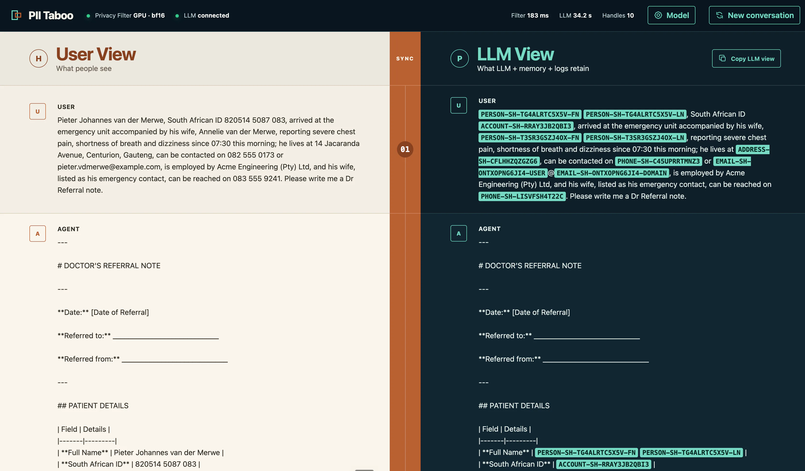

# PII Taboo

PII Taboo is a dependency-free proof of reversible, project-scoped
pseudonymisation around an LLM call.

It keeps the canonical conversation safe for model, memory, log, and cache reuse while
restoring a separate copy only at an authorised presentation boundary.



_Side-by-side demonstration using synthetic personal information._

## What it proves

1. A local PII detector returns sensitive text spans.
2. `pii_guard.py` replaces them with stable, typed project references.
3. Only protected messages, preservation guidance, and a derived opaque identity map go
   to the LLM.
4. The protected response remains canonical; a project-scoped vault can restore a copy.

Full names expose person identity and component roles alongside atomic name values, for
example `PERSON-SH-…-FN:NAME-SH-…`. A single detected name token uses
`PERSON-SH-…-UNRESOLVED:NAME-SH-…`, preserving a distinct mention identity without
guessing whether the value is a first name, surname, or mononym. Equal normalized name
values share the `NAME` reference within a project even when their `PERSON` identities
differ. Emails use
`EMAIL-SH-…-USER@EMAIL-SH-…-DOMAIN`. Unambiguous dates expose representation-aware day,
month, and year variants, allowing an LLM to reformat a date without learning its value.
Ambiguous numeric dates remain atomic.

Atomic name values are normalized with Unicode NFKC, collapsed whitespace, and Unicode
case folding before their project ID and type are included in the keyed HMAC. Honorifics
remain visible and are excluded from the name value. The vault retains the reverse map;
neither normalized nor original names are added to the downstream model payload.

For each model request, the guard derives an opaque identity-to-name-value map from
vault-emitted pairs in the protected history. Repeated `NAME` references make exact
normalized lexical equality explicit without merging the surrounding `PERSON`
identities or transferring their actions, roles, or authority. The derivation validates
opaque pair references without reading mapped values, so model-invented combinations are
ignored. This request-only map is inspectable in the protected UI lane; it is not added
to canonical conversation or Markdown memory.

The detector and vault remain inside the trusted boundary. The reverse map is never
sent to the downstream LLM. Project IDs are included in keyed fingerprints, preventing
the same value from receiving a correlatable reference across projects.

## Configure

Copy the public template:

```bash
cp .env.example .env
openssl rand -hex 32
```

Paste the generated value into `PII_VAULT_KEY` and configure the local detector and
OpenAI-compatible model endpoints in `.env`. The Python entry points load `.env`
automatically; variables already exported by the shell take precedence.

| Setting | Purpose |
| --- | --- |
| `PII_PRIVACY_URL` | Local detector base URL exposing `POST /detect` and `GET /health` |
| `PII_LLM_URL` | OpenAI-compatible chat-completions endpoint |
| `PII_LLM_MODEL` | Model name sent to that endpoint |
| `PII_LLM_API_KEY` | Optional model credential, kept server-side by the demo UI |
| `PII_LLM_REASONING_EFFORT` | Optional reasoning-effort value |
| `PII_VAULT_KEY` | Stable vault secret of at least 32 bytes |
| `PII_DEMO_VAULT_DB` | Local SQLite demonstration-vault path |
| `PII_DEMO_HOST`, `PII_DEMO_PORT` | Demo UI bind address and port |

`.env`, `.private/`, local vaults, browser traces, and research artefacts are ignored by
Git. Do not place real PII in public examples or fixtures.

## Run the command-line proof

Start a compatible privacy-filter service first. The companion
[OpenAI Privacy Filter on DGX Spark](https://github.com/ncmalan/OpenAI-Privacy-Filter-on-DGX-Spark)
repository provides the verified Spark setup and the `POST /detect` API used here.

```bash
python3 demo.py --project-id project-7 \
  "Please email Alice Smith at alice@example.com or call +27 82 555 0199."
```

The command prints the protected payload, raw protected response, and restored response.
Pass `--llm-url ''` to use the built-in simulated response instead of the configured
model.

## Run the comparison UI

```bash
python3 demo-ui/server.py
```

Open the configured local address, load the synthetic scenario, and compare the
authorised user view with the exact protected history retained for the LLM and memory.
The protected lane also exposes the request-only identity map separately from that
canonical history.
The optional web-search example resolves only the authorised domain argument at the
trusted tool boundary and protects the result before returning it to the LLM.

## Integration pattern

```python
vault = PiiVault("project-vault.sqlite3", project_id, secret_key)
protected, _ = protect_messages(history, detector, vault)
outbound = model_messages(protected[1:], vault)
```

Filter newly ingested user and tool content. Retrieved protected history does not need
to be scanned again. Store the protected assistant response and restore only a copy at
the authorised presentation edge.

Known spelling or format variants can be reconciled explicitly with
`vault.add_alias(reference, type, value)`. Uncertain identity consolidation remains an
application decision; the guard does not guess that two similar names identify one
person.

## Check

```bash
python3 -m unittest -v
```

## Security status

This is evidence for data minimisation, not anonymisation, production security, or a
compliance guarantee. Automated detection can miss or over-redact PII. The demonstration
vault is plaintext SQLite protected only by local file permissions.

Read [THREAT_MODEL.md](THREAT_MODEL.md) before adapting the proof. Production use needs
in-domain evaluation, authenticated transport, fail-closed error handling, encrypted
and access-controlled vault storage, key rotation, audit, retention controls, and
authoritative authorisation at every restoration boundary.

Report security issues privately as described in [SECURITY.md](SECURITY.md).

## License

Apache License 2.0. See [LICENSE](LICENSE).
